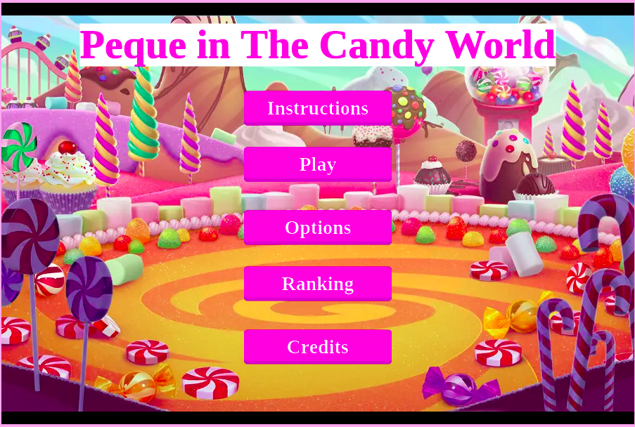

# 🧐 JS-Capstone: Peque in The Candy World (JS-Game)

## :scroll: Concept

> Peque in the World of Sweets is a platform video game like the games of yesteryear, created as part of the Microverse JavaScript capstone.



## :octocat: Usage

- This project intends to show my skills on JavaScript ES6
## 🛠 Built

- Javascript ES6
- Phaser 3 Game Engine
- Extern API
- Webpack
- HTML 5
- CSS

## 🔴 Live Demo

[Live Demo](https://sharp-clarke-b3b6a5.netlify.app/)


## 🔧 Getting Started

To get a local copy up and running follow these simple example steps.

### 📝 Prerequisites

This is an example of how to list things you need to use the software and how to install them.
* npm

```sh
npm install npm@latest -g
```

### 📝 Installation

1. Get a free API Key at [https://www.notion.so/Leaderboard-API-service-24c0c3c116974ac49488d4eb0267ade3](https://www.notion.so/Leaderboard-API-service-24c0c3c116974ac49488d4eb0267ade3)
2. Clone the repo
```sh
git clone git@github.com:diazgio/JS-Capstone.git
```
3. Install NPM packages
```sh
npm install
```
4. Enter your API in `api.js`
```JS
const key = 'Enter Your API';
```
5. Run Webpack dev-server
```sh
npm run start
```
6. Run the Tests:
```sh
npm run test
```
## 👤 Authors

- Github: [@diazgio](https://github.com/diazgio)
- Twitter: [@giordano_diaz](https://twitter.com/giordano_diaz)
- LinkenIn:[giordano-diaz](www.linkedin.com/in/Giordano-Diaz) 

## 🤝 Contributing

Contributions are what make the open source community such an amazing place to be learn, inspire, and create. Any contributions you make are **greatly appreciated**.

1. Fork the Project
2. Create your Feature Branch (`git checkout -b feature/AmazingFeature`)
3. Commit your Changes (`git commit -m 'Add some AmazingFeature'`)
4. Push to the Branch (`git push origin feature/AmazingFeature`)
5. Open a Pull Request

Feel free to check the [issues page](https://github.com/diazgio/JS-Capstone/issues).

## :pray: Show your support

Give a ⭐️ if you like this project!

## Acknowledgments

- Microverse
- GitHub
- The-Thanatos Team
- Sanad Abujbara: [@sanadwj](https://github.com/sanadwj)

## 📝 License

This project is [MIT](https://opensource.org/licenses/MIT) licensed.